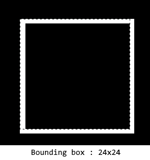

bsp2bmp
=======

BSP2BMP: a BSP map file wireframe picture generator

# Changes in this fork

- Builds on a modern x64 Linux install (tested on Ubuntu 18.04).
- Builds on Windows (tested on W10/Visual Studio 2019).
- Will draw the map centred in the image with a minimum safe (as in "crash free") border of 1 pixel.
- When using the -j flag, dumps useful measurements into a JSON file. This is specifically to assist in building minimap images for ezQuake, aka "radars", which embed special metadata calculated from these measurements.

# Usage for radars

I would recommend to go with the following options:

`bsp2map -s1 -z0 -p1 -e <bspfile> [outfile]`

This will render the map top-down, flat (`z0`) at a scale of 1 unit per pixel (`-s1`) with a minimal border (`-p1`).
Extraneous edge removal might be a little weird at times - might as well disable it (`-e`).

The full scale render may be a bit unwieldy, but much more comfortable to work with in whatever art pipeline you go for (you can always scale down later).

If you also want to calculate the metadata for ezQuake, you can dump the map's measurements and padding/scaling options by adding `-j1` in the options, or `-j2` if you only want the numbers and don't need the image drawn again.

# JSON data format

The ezQuake radar images are tagged with some custom metadata specifying the map's origin coordinates and width/height scaling ratios.
This metadata can be calculated from some map and radar image measurements. The JSON data is a collection of integer values:

- **minX** : integer the map's leftmost X coordinate, in map units.
- **minY** : the map's topmost Y coordinate, in map units..
- **width** : the map width, in map units.
- **height** : the map's length, in map units. (we are looking down from above, so this isn't the actual Z height)
- **imageWidth** : the generated image width in pixels.
- **imageHeight** : the generated image height in pixels.
- **padding** : the border in pixels (value of `-p`).
- **scaling** : the scaling factor of the image, units per pixel (value of `-s`, default is 4, i.e 1/4 scale).

Keep in mind that due to the way bsp2bmp does its drawing (numbering starts at 0, 1 pixel line thickness), the overall image dimension is 1px wider than simply `padding + (map dimension* scaling ) + padding`.

This bsp block of 24x24 units (selection) is drawn in 25x25px (white lines).